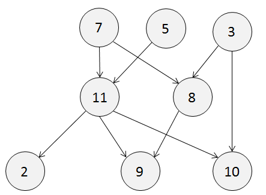
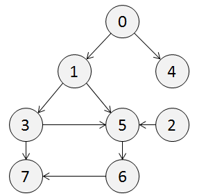

# topological-sort
A simple implementation of the topological sort algorithm.

[![Coverage Status][coverage-status]](https://coveralls.io/github/otaviokr/topological-sort?branch=master)
[![Build Status][build-status]](https://travis-ci.org/otaviokr/topological-sort)

## Overview

Suppose you have a directed graph. To sort it topologically is to generate a linear ordering of its vertices such that
for every edge *UV* from vertex *U* to vertex *V*, *U* comes before *V* in the ordering. It is important to notice that
a topological sort can only be done if - and only if - the **graph has no directed cycles**; such graph is usually
called a **directed acyclic graph**, or DAG.

A directed graph may have more than one topological ordering.

## Algorithms

This package contains implementations of two famous algorithms to solve topological sorting problems: *Kahn's* and
*Tarjan's*, each one has its own approach and can produce different - yet equally valid - solutions.

### Kahn's

The algorithm identifies first the "orphans" (nodes that have no parent node) and appending them to a list. Then,
it takes the first item from the orphan list, add it to the sorted list (the final solution) and remove all edges
from that node to another node; if any node becomes an orphan after that operation, it will be appended to the
orphan list. Repeat until all nodes are in the final solution list.

### Tarjan's

Tarjan's algorithm walks the tree until it founds a "leaf" (a node with no children), add it to the head of the sorted
list (the final solution) and then step back to check the previous node. It is basically the depth-first search
algorithm applied to sorting.

## Example



All the following orderings are valid topological sort outcomes of the example graph above. Each one has an arbitrary,
secondary criteria to consistently visit the nodes. Because this module does not follow any particular secondary
criteria, executing it on this graph could result in any of that outcome randomly.

- **7, 5, 3, 11, 8, 2, 9, 10** (visual left-to-right, top-to-bottom)
- **3, 5, 7, 8, 11, 2, 9, 10** (smallest-numbered available vertex first)
- **5, 7, 3, 8, 11, 10, 9, 2** (fewest edges first)
- **7, 5, 11, 3, 10, 8, 9, 2** (largest-numbered availabled vertex first)
- **7, 5, 11, 2, 3, 8, 9, 10** (attempting top-to-bottom, left-to-right)
- **3, 7, 8, 5, 11, 10, 2, 9** (arbitrary; no specific secondary criteria)

This example was taken from
[Wikipedia's article on topological sorting](wikipedia-toposort).

## Limitations and Design Decisions

In the current version, all functions to generate the topological sort does **not** use any secondary criteria for
ordering - for example, if there's two equivalent child nodes, it will choose which one to visit first randomly.

## Usage

The example below is a complete example (just run it!) with both functions being called for the following graph:



```go
package main

import (
  "fmt"
  "github.com/otaviokr/topological-sort/toposort"
)

func main() {

  // Leaf nodes (those that have no children), can be omitted in the map.
  // In the example below, you can remove entries with keys "4" and "7",
  // and still get the same result.
  unsorted := map[string][]string{
    "0": {"1", "4"},
    "1": []string{"3", "5"},
    "2": []string{"5"},
    "3": []string{"5", "7"},
    "4": {},
    "5": []string{"6"},
    "6": []string{"7"},
    "7": {},
  }

  sorted, err := toposort.KahnSort(unsorted)
  if err != nil {
    panic(err)
  }
  fmt.Printf("Result by Kahn's: %v\n", sorted)

  sorted, err = toposort.TarjanSort(unsorted)
  if err != nil {
    panic(err)
  }
  fmt.Printf("Result by Tarjan's: %v\n", sorted)

  reversedKahn, err := toposort.ReverseKahn(unsorted)
  if err != nil {
    panic(err)
  }
  fmt.Printf("Reversed Kahn result: %v\n", reversedKahn)

  reversedTarjan, err := toposort.ReverseTarjan(unsorted)
  if err != nil {
    panic(err)
  }
  fmt.Printf("Reversed Tarjan result: %v\n", reversedTarjan)
}
```

[coverage-status]: https://coveralls.io/repos/github/otaviokr/topological-sort/badge.svg?branch=master
[build-status]: https://travis-ci.org/otaviokr/topological-sort.svg
[wikipedia-toposort]: https://en.wikipedia.org/wiki/Topological_sorting
